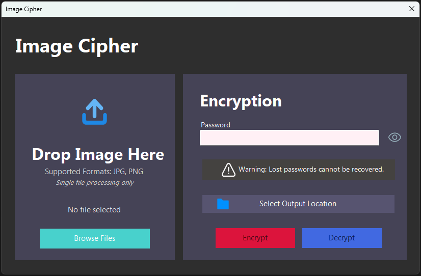

# 🖼️ Secure Image Cipher - Desktop Application

A professional Windows Desktop application built with **C#** and **.NET** that demonstrates the practical implementation of **Symmetric Encryption** (AES) and **Hashing** (SHA-256) to secure image files.

---

## 💡 About the Project

This project was developed as a practical application. It provides a real-world tool that protects user privacy by encrypting images (JPG/PNG) with a custom password. It solves the common issue of "fixed-length keys" by utilizing hashing for flexible user input.

---

## ✨ Key Features

- 🔒 **Strong Encryption:** Implements the **AES-128 (Advanced Encryption Standard)** algorithm for high-level security.
- 🗝️ **Flexible Key Derivation:** Uses **SHA-256 Hashing** to allow users to input any password length, which is then transformed into a valid 16-byte cryptographic key.
- 📥 **Drag & Drop Interface:** Modern UI supporting "Drag and Drop" for seamless image loading.
- 📜 **Professional Error Logging:** Integrated with the **Windows Event Viewer** to track and log errors (Cryptographic and System exceptions) without interrupting the user.

---

## 🛠️ How it Works (The Technical Logic)

### 1. Encryption Process

- **Password to Key:** The user input string is hashed using **SHA-256**, and the first 16 bytes are extracted to form the AES Key.
- **File Structure:** The IV is written at the very beginning (header) of the output file, followed by the encrypted image data.

### 2. Decryption Process

- **IV Extraction:** The application reads the first 16 bytes from the encrypted file to retrieve the original IV.
- **Data Restoration:** Using the retrieved IV and the user's password, the algorithm decrypts the remaining bytes and restores the original JPG/PNG image with **100% integrity**.

---

## 💻 Technologies Used

- **Language:** C#
- **Framework:** .NET Framework (WinForms)
- **Security:** `System.Security.Cryptography`
- **Logging:** `System.Diagnostics.EventLog`

---

## 🚀 Getting Started

### Prerequisites

- **Visual Studio 2022** (or later) with .NET Desktop Development workload.
- **Windows OS** (Required for Event Viewer integration).

### Installation & Run

1. Clone the repository:
   ```bash
   git clone https://github.com/AAkhzami/ImageCipher.git
   ```
2. Open the .sln file in Visual Studio.
3. Important: Run Visual Studio as Administrator (Required for the first run to create the Event Log source).
4. Build and Start the application.

---

## 📸 UI Preview



---

## 🛡️ Why Administrator Privileges?

This app requires administrative rights because it uses the Windows Event Log to professionally track errors. A custom app.manifest is included to ensure the application requests these permissions upon startup.
